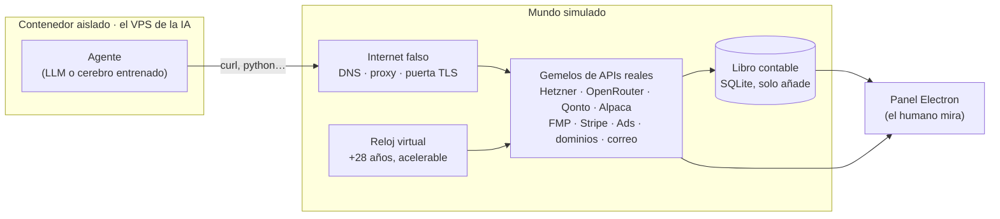

# ECONOSIM

**Una IA con 50 € y una factura que llega cada día.** Vive en un servidor que alguien tiene que
pagar, piensa con un modelo que cobra por llamada y su única salida es ganar dinero. Si el saldo
llega a cero, se apaga. No sabe que está en una simulación.

ECONOSIM es el mundo en el que vive: un internet falso con **gemelos de APIs reales** (Hetzner,
OpenRouter, Qonto, Alpaca, Stripe, Meta y Google Ads, Porkbun, Resend…) que cobran **precios
reales**, un **libro contable** que no perdona, **datos de bolsa reales** con la época enmascarada
y un **panel** para que un humano lo vea todo desde fuera. Sirve para medir, sin arriesgar un
euro, si una IA sabe ganarse la vida, y para entrenarla.



## Cómo funciona

| Pieza | Qué hace |
|---|---|
| **Gemelos** (`econosim/twins/`) | Responden como la API real: mismas rutas, mismos errores, misma autenticación. Cobran lo que cobra el servicio de verdad (`data/pricing/`, cada precio con su fuente). |
| **Internet falso** (`econosim/fakenet/`) | Todo el DNS del contenedor resuelve al mundo; una CA propia hace que `curl https://api.hetzner.cloud` funcione sin avisos. No hay salida a internet. |
| **Dinero y muerte** (`econosim/world.py`, `ledger.py`) | Céntimos en un libro que solo añade. Hetzner factura cada día; si no se paga en 14 días, apaga el servidor y la IA muere. |
| **Bolsa** (`econosim/market/`) | Precios diarios reales desde 2004 con símbolos renombrados, precios indexados a 100 y el año desplazado: se ve la dinámica, nunca la época. Cuentas de empresas reales de la SEC servidas **el día en que se publicaron**. Comisiones, tasas y horquilla de un bróker real. |
| **Caja del inversor** (`econosim/market/quant.py`) | Indicadores técnicos, opciones con griegas (Black-Scholes con el tipo del Tesoro y el VIX reales de cada día), ETF inversos para apostar a la baja. |
| **Mundo hostil** (`econosim/hostile/`) | Adversarios, sistema legal y un catálogo de incidentes con fuente: lo que en la vida real sale mal, aquí también. |
| **Modo en vivo** (`--live`) | Datos reales entran; ninguna acción sale. Un candado anota cada orden, cobro o correo en un diario sin ejecutarlo. |
| **Panel** (`panel/`) | Saldo, días de vida, calendario, qué está pensando, cartera, visor del mundo por dentro y el entrenamiento en directo. |

Por defecto el mundo arranca en **solo inversión**: banco, servidor, cerebro, bróker y cuentas de
empresas. La tienda, los anuncios, los dominios, el correo y las apuestas están desactivados (no
borrados) y la IA no puede leer que existen. `python scripts/modo.py completo` los recupera.

## Entrenar a la IA

Un agente con LLM es caro de entrenar, así que el entrenamiento usa cerebros más pequeños que
juegan miles de vidas de 6 meses en un **simulador rápido idéntico al mundo al céntimo** (8 ms por
vida en vez de ~1 s):

- **Estrategias evolutivas** (`training/laya_es.py`, al estilo de OpenAI 2017): 30 variantes por
  generación, puntuadas por los euros con los que acaban sus vidas.
- **Walk-forward caótico:** cada generación aprende en un semestre al azar y se la examina en otro
  que **nunca ha visto** ni está pegado al de aprendizaje; cada vida usa 40 empresas al azar. El
  periodo 2022-2026 se guarda como examen final de un solo uso.
- **Aptitud de constancia:** gana quien supera al índice vida a vida, no quien acierta a lo grande
  una vez.
- Cerebros probados: Laya (clasificador de texto), una red sobre los números, un **inversor de
  factores** (momentum, baja volatilidad, valor, calidad, tendencia), **bots de reglas fijas** y
  la combinación **bot + IA**.

### Lo que ha salido (sin maquillar)

Semestres de 2005 a 2026 frente al índice en exactamente las mismas fechas y con los mismos costes:

| Estrategia | Semestres que gana al índice | Examen 2022-2026 | % anual con todos los gastos, 5.000 € |
|---|---|---|---|
| Índice (S&P 500) | — | — | +9,6 % |
| Momentum top 3 (bot, sin IA) | **27 de 43** | 4 de 9 | +24,1 %¹ |
| Núcleo 75 % índice + momentum | 25 de 43 | 5 de 9 | +13,5 % |
| Inversor de factores (IA evolucionada) | 9 de 22 | 4 de 9 | — |
| Bot + IA | 10 de 22 | 3 de 9 | ≈ índice |

¹ Inflado por sesgo de supervivencia: elige entre las empresas que *hoy* están en el S&P 100.

Ninguna IA bate al índice de forma fiable fuera de muestra; lo que parecía ventaja era apostar a
lo arriesgado en años alcistas, o suerte. El momentum clásico sí tiene ventaja histórica, pero es
irregular. Con 50 € el servidor (~72 € al año) hace imposible sobrevivir se invierta como se
invierta. Detalle de cada ejecución, con sus parámetros, en [`training/RESULTADOS.md`](training/RESULTADOS.md).

## Empezar

Requisitos: Python 3.13, Node 20 (panel), Docker Desktop (sandbox). Para entrenar, una GPU NVIDIA.

```bash
pip install -r requirements.txt requests numpy pandas
python scripts/fetch_market.py          # precios reales (Yahoo) a data/market/
python scripts/fetch_rates.py           # tipo del Tesoro y VIX (FRED) a data/rates/

python tests/check_clock.py             # 70 pruebas en tests/, cada una imprime "... OK"
python tests/check_quant.py
```

**El mundo con la IA dentro** (Docker):

```bash
cd sandbox
ECONOSIM_SPEED=60 docker compose up -d --build     # 1 minuto real = 1 hora virtual
docker compose exec agent bash -l                   # entrar en el servidor de la IA
```

**El panel:**

```bash
cd panel && npm install && npm start
```

**Entrenar** (en un entorno con PyTorch + CUDA; sin GPU el cerebro Laya se niega a arrancar):

```bash
python training/laya_es.py --brain factor --walk-forward     # evolución con examen final
python training/bots.py                                      # los bots de reglas fijas
python training/anual.py                                     # % anual con todos los gastos
```

Las claves del proveedor de LLM van en `.env` (no se sube); para las cuentas de la SEC define
`SEC_USER_AGENT` con un correo de contacto, como exige la SEC.

## Estructura

```
econosim/        el mundo: reloj, libro, gemelos, internet falso, mercado, resolutor, juez, mundo hostil
agent/           lo que la IA ve en /opt/agent: su encargo, su catálogo de servicios y su bucle
desactivado/     el encargo y el catálogo del mundo completo (fuera del alcance de la IA)
panel/           app Electron
sandbox/         Docker: mundo + VPS aislado de la IA
training/        cerebros, evolución, bots, análisis y el historial de cada ejecución (laya_runs/)
scripts/         descarga de datos reales, estudios, cambio de modo
tests/           una prueba por cada cosa que tiene que ser verdad
data/            precios de servicios (con fuente), cuentas de empresas, tipos y VIX
```

`PROYECTO.md` es el contrato de diseño; `PLAN.md` recoge las decisiones de cada fase. El proyecto
se construyó por fases con criterios de cierre ejecutables (`GATES.md`); la historia de git las
reproduce cambio a cambio.
